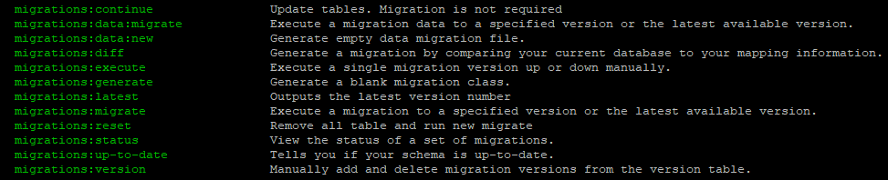

# Migrations

Doctrine migrations form Nette Framework.

This extension allows import data independently from a schema change and maintain version import data.

Why is created? This extension is suitable for management migrations in the bundles.

Required:
- [nette/di](https://github.com/nette/di)
- [kdyby/console](https://github.com/Kdyby/Console)
- [doctrine/migrations](https://github.com/doctrine/migrations)

## Install

````sh
composer require chomenko/migrations
````

## Configuration
Register extensions
```neon
extensions:
	console: Kdyby\Console\DI\ConsoleExtension
	migrations: Chomenko\Migrations\DI\MigrationsExtension 
```

Settings:
```neon
migrations:
    table: doctrine_migrations
    column: version
    directory: %appDir%/../Migrations
    dataDirs: []
    namespace: Migrations
    dataNamespace: MigrationsData
```

## Commands

Commands list. ``php www/index.php list``

